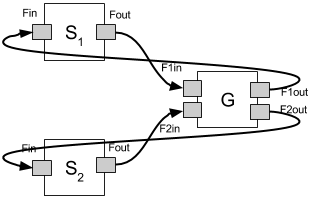
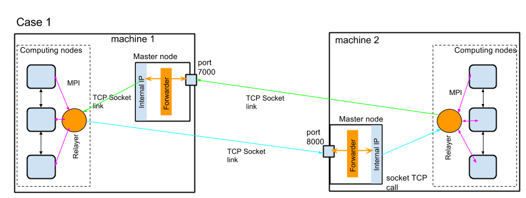
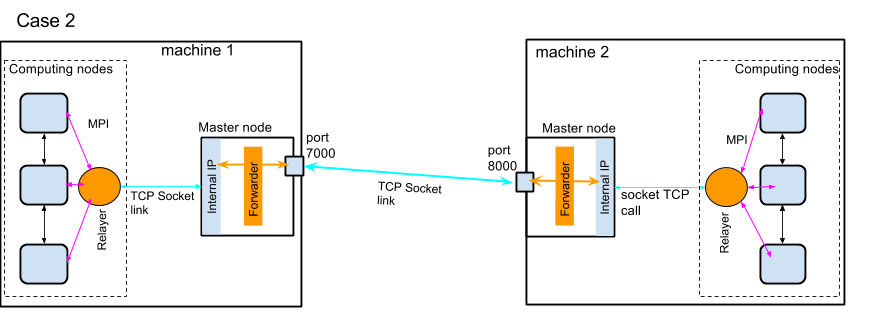

**MUSCLE-HPC** is a high performance API written in C++/MPI. It can be used to couple multiscale parallel applications (see [muscle-HPC paper] (http://dx.doi.org/10.1016/j.future.2016.08.009)).

# Installation

## Location 
The muscleHPC is located in this GIT repository:
```sh
$ git clone  https://USERNAME@gitlab.com/benbelga/muscleHPC.git
```
    

## Dependencies
In order to compile a  MuscleHPC application, you need:

- C++ 11 (tested with GNU c++ compiler)
- Python
- Boost: boost_regex, boost_program_options

## Compiling MUSCLE-HPC libraries
Download the muscleHPc source code and then:
```sh
    $ cd muscleHPC/
```

Modify the Makefile and run the command line:
```sh
	$ make -f Makefile
```

This will generate dynamic and static libraries in the **./lib** directory
```sh
    $ ls  lib/
        libmusclehpc.a  libmusclehpc.so
```
and will compile the examples in the directory **./test**.

The include headers file are located in the **./include** directory.

# Running simulations 


Suppose that we have a three coupled submodels S1, G and S2 as depicted in the figure above (see also the example in test/3_submodels/ directory )  and a coupling description file **couplingFile.txt** as follow:

    conduit1<int>: S1.f_out -> G.f1_in
    conduit2<int>: S2.f_out -> G.f2_in
    conduit3<char>: G.f1_out -> S1.f_in 
    conduit4<char>: G.f2_out -> S2.f_in
    cores<S1>:4
    cores<S2>:4
    cores<G>:1
    cmdline<S1>: command line arguments for submodel S2
    cmdline<S2>: command line arguments for submodel S2
    cmdline<G>: command line arguments for submodel G

After compiling the code we generate a binary file (we call it here **Prg**). It exists 2 ways to run this simulation: on one machine and across different machines.


## Execution on one machine
### Within the same binary:
In order to start all the 3 submodels within the same binary, we run:
```sh
$ mpiexec -np X ./Prg -c couplingFile.txt -m -a 
```
The option **-a** in the command line  enables to  run S1, S2 and G within the same binary provided that the number of available cores **X** is greater or equal to the sum of cores requested in the coupling file + 1 core for the manager. In this example, X should be >= 10=4+4+1+1.


### Distributed execution
It is possible to run each submodel (or each set of submodels) in a separate execution. As an example we will run **S1+G** in the same execution and **S2** in another execution. Here is the two command lines:
```sh
$ mpiexec -np X ./Prg -c couplingFile.txt -m -k S1 -k G
$ mpiexec -np X ./Prg -c couplingFile.txt  -k S2 -M "Manager_URL"
```


In the first command line we run the submodels **S1+G** (option **-k**) and  the manager (option **-m**) in the same binary. Upon execution the manager will print the ManagerURL and wait. For instance:
```sh
$ mpiexec -np 6 ./Prg -c couplingFile.txt -m -k S1 -k G
    ...
    Manager available at: "2330984448.0;tcp://1.2.3.4:41325;tcp://192.168.5.1:41325+2330984449.0;tcp://1.2.3.4:59280;tcp://192.168.5.1:59280:303" 
    ...
```

In the second command line, we need to run **S2** and specify the manager URl (option **-M**):
```sh
mpiexec -np 4 ./Prg -c couplingFile.txt  -k S2 -M "2330984448.0;tcp://1.2.3.4:41325;tcp://192.168.5.1:41325+2330984449.0;tcp://1.2.3.4:59280;tcp://192.168.5.1:59280:303"
```

Once the second command line is launched, all the submodels start their executions (SEL loop). 

>Note that we can also run the manager alone if needed as follow:

```sh
$ mpiexec -np 1 ./Prg -c couplingFile.txt -m
```

## Execution across two machines or more
It is possible to run a simulation across two machines or more where nodes of each machine can not reach each other. To do so, we need to run a [**Forwarder**](src/forwarder/Forwarder.py). A **Forwarder** is a *Python* program that runs on the master node of a cluster and acts as an MTO in comparison with Muscle2. The *Forwarder* works with the **Relayer** which is a daemon running on one core in each binary. Whenever it is possible the **Relayer** gets the data from the submodels and forwards them directly to the adequate **Forwarders** on the remote machines where the remote submodels are located (see Figure of case 1). If this is not possible (for instance in case of a restriction policy preventing internal nodes to reach the outside network) then the **Relayer** forwards the data to the **Forwarder** of the same machine which will forward it to the corresponding remote **Forwarder** (Figure of case 2).

Note that the option **-t** must be specified in order to force the use of *TCP* mode in the simulation.

### Illustration by an example

Let's consider that:
* The **machine 1** has a Public IP (148.187.25.10), an internalIP (10.192.25.10) and an opened port 7000 -> 148.187.25.10:10.192.25.10:7000
* The **machine 2** has a Public IP (148.187.26.20) an internalIP (10.192.12.20) and an opened port 8000 -> 148.187.26.20:10.192.12.20:8000
* **S1** and **G** run on machine 1
* **S2** runs on machine 2

There exists two ways to use the **Forwarders** which will be exolaned bellow in two cases.

#### Case 1:



We run the Forwarder 1 on machine 1 on port 7000:
```sh
python forwarder.py -p 7000
```
We run the Forwarder 2 on machine 2 o port 8000:
```sh
python forwarder.py -p 8000
```

We run **S1** and **G** on machine 1 and specify the local forwarder:
```sh
mpiexec -np 6 ./Prg -c couplingFile.txt -t -m -k S1 -k G -f "148.187.25.10:10.192.25.10:7000" 
```
We run **S2**  on machine 2 and specify the local forwarder:
```sh
mpiexec -np 4 ./Prg -c couplingFile.txt -t -k S2 -M "MANAGER_URL" -f "148.187.26.20:10.192.12.20:8000"
```

#### Case 2



We run the Forwarder 1 on machine 1 and specify the remote forwarder of machine 2 using the option **-f**:
```sh
python forwarder.py -p 7000 -f  "148.187.26.20:10.192.12.20:8000"
```
We run the Forwarder 2 on machine 2 and specify the remote forwarder of machine 1 using the option **-f**:
```sh
python forwarder.py -p 8000 -f  "148.187.25.10:10.192.25.10:7000"
```

We run **S1** and **G** on machine 1 and specify the local forwarder:
```sh
mpiexec -np 6 ./Prg -c couplingFile.txt  -t -m -k S1 -k G -f  "148.187.25.10:10.192.25.10:7000"
```
We run **S2**  on machine 2 and specify the local forwarder:
```sh
mpiexec -np 4 ./Prg -c couplingFile.txt  -t -k S2 -M "MANAGER_URL" -f  "148.187.26.20:10.192.12.20:8000"
```


## How to write a C++ submodel
Let consider two instances of a submodel **Sample** as dipected in the Figure below (see [mpiringData_async.cpp](test/mpiring/example2/mpiringData_async.cpp) file for more details). 


```cpp
class Sample: public MpiSubmodel{
private:
    
    int iterationCounter;
    // MML ports
    ConduitEntrance<char> *f_out;
    ConduitExit<char> *f_in;
    
    // kernels parameters
    int argc;
    char ** argv;
    
    MPI_Request  listISendReq [2];
    MPI_Request  listIRecvReq [2];
    
public:
    
    Sample():MpiSubmodel() {
        iterationCounter=0;
    }
    virtual ~Sample(){}
    
    virtual void F_init(){
        
        // read argc and argv parameters form the coupling file
        this->argc=this->getKernelArgc();
        this->argv=this->getKernelArgv();
        // init parallel conduits
        f_out=this->getConduitEntrance<char>("f_out");
        f_in=this->getConduitExit<char>("f_in");
        // print message
        stringstream ss;
        ss<< this->getName() <<" rank "
        << this->getMpiManager()->getRank() <<" is started --> argv: ";
        for (int i = 0; i< this->argc; i++){
            ss<<this->getKernelArgv()[i] <<" ";
        }
        cout<<ss.str()<<endl;
    }
    virtual void Oi(){ /*put an observation*/}
    virtual void Of(){
        /*put final observation*/
    }
    virtual void S(){
        iterationCounter++;
    }
    
    virtual bool isConverged(){
        return !(this->iterationCounter < 10 );
    }
    
    virtual void U(){
        
        const int buff_size = 100;
        // create a dummy vector of int
        std::vector<int> vect(buff_size);
        for (int i = 0; i< buff_size ; i++){
            vect[i]=i+this->iterationCounter;
        }
        // Here each MPI process will send/receive from remote process remote having the same rank
        int dest = this->getMpiManager()->getRank();
        MPI_Status  status [2];
        /// ----- non blocking sending of data -----
        int buf_len = vect.size()*sizeof(int);
        f_out->iSend((char*)&buf_len, sizeof(buf_len), dest, &listISendReq[0]);
        f_out->iSend((char*) vect.data(), buf_len, dest, &listISendReq[1]);
        /// ----- non blocking receiving of data ----
        int bufRecv_len_1=0;
        // receives data sizes
        f_in->iRecv((char*)&bufRecv_len_1, sizeof(bufRecv_len_1), dest, &listIRecvReq[0]);
        // wait until the iRecv of the length of the data to receive is done
        MPI_Waitall(1, &listIRecvReq[0], &status[0]);
        // then receives data
        vector<int> vectRecv;
        vectRecv.resize(bufRecv_len_1/sizeof(int));
        f_in->iRecv ((char*) &vectRecv[0], bufRecv_len_1, dest, &listIRecvReq[0]);
        // wait until the iRecv of data is done
        MPI_Waitall(1, &listIRecvReq[0], &status[0]);
        // ----- verify received data -----
        for (int i = 0; i< buff_size ; i++){
            assert ((vectRecv[i] == ( i+this->iterationCounter))  && "error in assertion");
        }
        /// ----- free data ------
        vector<int>().swap(vect);
        vector<int>().swap(vectRecv);
        /// ---- wait asynchrone iSend to finish
        MPI_Waitall(2, &listISendReq[0], &status[0]);
    }
};
```
### coupling file
```
conduit1<char>: S1.f_out -> S2.f_in
conduit2<char>: S2.f_out -> S1.f_in
cores<S1>:4
cores<S2>:4
cmdline<S1>: params1 param2
cmdline<S2>: params1 param2 param2
```

This example shows a simple coupling between two submodels **S1** and **S2**. The class Sample extends the abstract class `MpiSubModel`. So, the methods **isConverged()**, **F_init()**, **Oi()**, **S()**, **U()** and **Of()** should be implemented. `ConduitExit<char> *exit` and `ConduitEntrance<char> *entrance` are two attributes that represent two **MMSF** ports. We consider in this example that a submodel has one entry and one exit port: the entrance (resp. exit) attribute is used to send (resp. receive) data of type `*char`. Note that the type of data associated to each conduit (entry or exit) could be different (int, long, float, double, char, etc).

The coupling description file has the following syntax:
```
ConduitName<DataType>: SubModelName1.PortName −> SubModelName2.PortName
```

In our example, we define two conduits **conduit1** and **conduit2**. The first (resp. second) conduit handles transferring data of type `<char>` from the **f_out** port of submodel **S1** (resp. **S2**) to the **f_in** port of submodel **S2** (resp. **S1**). Besides, the users can specify the number of cores to be allocated to submodels S1 and S2 (`cores<S1>:4`  means we allocate 4 cores for **S1**). Besides, the user has the possibility to specify a command line argument per submodel.


In the Sample class, the **F_init()** method initializes the entrance and exit ports. In this example, the simulation performs 10 iterations and the the stop condition is implemented accordingly in the **IsConverged()** method. The **S()** method simply increments a counter with no intermediate observation. The data exchange between the two submodel occurs in the **U()** method. The implemented communication template is an asynchronous  data send/receive where each MPI process of each submodel sends/receives data to the MPI process of the remote submodel having the same rank. 

Let's suppose now that we have  a **broadCast** instead of the **iSend/iRecv** operations. Since the  **broadCast** operation uses an *MPI inter-communicator*, and when **S1** sends data to **S2**, the rank of the broadcasting root process of **S1** should be set to `MPI_ROOT` and to `MPI_PROC_NULL` for the other MPI processes of the same submodel. It goes without saying that in the target submodel **S2** we need to call the appropriate methods to receive the data and specify the rank of the broadcasting root process of submodel **S1**, according to the standard specification of MPI. Note that the method **bCast(...)** of the MpiManager calls **MPI_Bcast(...)** underneath (see [broadcast.cpp](test/broadcast/example1/broadcast.cpp) example for more details.

### How one can use standard MPI methods?
In case this is needed, we can retrieve all required information to use standard MPI routines with the adequate parameters. The code below illustrates a simple example:
```c++
ConduitEntrance<char> * entrance = this->getConduitEntrance<char>("f_out");
shared_ptr<MpiManager> handlerMpiManager = entrance->getHandlerKernel()->getMpiManager();
shared_ptr<MpiManager> interCommManager= entrance->getHandlerInerCommunicatortManager();

// example send a char buffer to the remote MPI process having the same rank as the sender process.
int count = 100; // size of data buffer
char * buf = new char[count]; // dummy data
int des =  handlerMpiManager->getRank(); // current process rank

// get the MPI_TAG of the conduit used for the inter-communication between the two submodels
Int interTag = entrance->getConduitTag(); 

// get the MPI-intercommunicator create between the two submodels and used by the conduit
MPI_Comm interCom =  interCommManager->getGlobalCommunicator(); 

// call the MPI routine MPI_Send(...)
MPI_Send(buf, count, MPI_CHAR, dest, interTag,  interCom);
```

**Note**: This future is not compatible with the *TCP* mode (option **-t**). 
